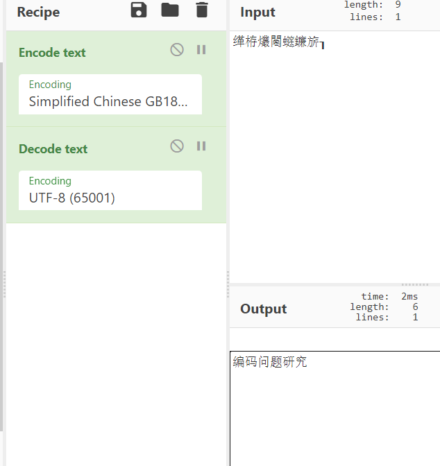
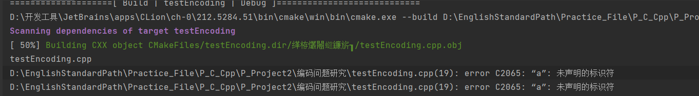

在控制台窗口观察到如下文本：

鎸囧畾杩愮畻瀵硅薄鐨勭被鍨嬫槸娴偣鏁拌繕鏄弻绮惧害娴偣鏁般€傛湰绋嬪簭榛樿鏄弻绮惧害娴偣
鏁般€?

这是在 utf-8编码下，对于一个二进制的解释。
二进制如果是错误的，那么我们更改解释，也无法得到正确的显示。

第一步，我们把这段字符串用gbk保存。
这一步操作的实质是一个基变换。       
    二进制*utf-8 = 显示
    要使得 显示不变。     二进制`*gbk = 显示 = 二进制*utf-8;

第二步, 我们用utf-8解释新的二进制`

    正确显示 = 二进制`*utf-8 =  二进制 * utf-8 * gbk^-1 * utf-8;

操作系统复制： 是为了保证显示不变。

- cmake 为什么不能识别中文？

- g++编译方式
g++对源码的识别默认是utf-8
g++把源码编译成控制台程序之后，可以编译出一个面向utf-8控制台的程序
  -fexec-charset=GBK 加上这一句再编译，那么打出到控制台的时候就会面向GBK

